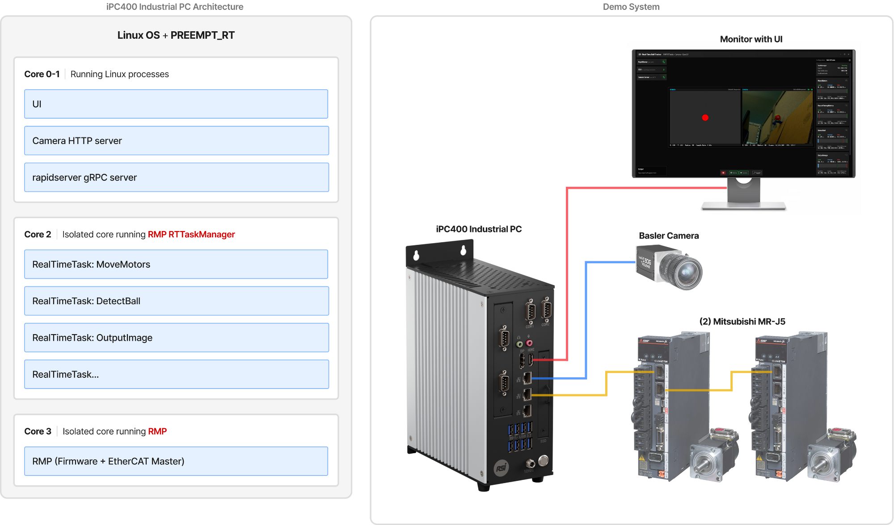

# RapidLaser (Vision Tracking Gimbal Demo)

RapidLaser is a mechanical demonstration designed to showcase the precision of RSI's RMP EtherCAT Motion Controller, specifically its [**RealTimeTasks**](https://support.roboticsys.com/rmp/rttasks.html) feature which allows you to execute deterministic user logic, motion control, and I/O operations without specialized real-time programming expertise.  

It features a two-axis gimbal mechanism that uses Basler's Pylon SDK and OpenCV to track a colored ball in real time, dynamically positioning a laser to keep the ball centered.

## 🚀 Features

- Real-time tracking using OpenCV & Pylon SDK
- Two-axis gimbal system
- Motion control using the [RMP EtherCAT Motion Controller](https://www.roboticsys.com/rmp-ethercat-motion-controller)
- Multi-platform UI developed using Avalonia UI
- Linux PREEMPT_RT for sub millisecond deterministic control

## 📁 Project Structure

- `rttasks/` - Core source code containg the RMP RealTimeTasks functions
- `scripts/` - Utility scripts for running the UI, and more
- `servers/` - Contains the .NET 10 camera server for sending images to the UI
- `ui/` - Main desktop demo UI/app (RapidLaser.Desktop)

## 📦 Prerequisites

- Linux PC
- [RMP SDK](https://www.roboticsys.com/rmp-ethercat-motion-controller)
- .NET 9.0 SDK & .NET 10 SDK
- Basler camera (with Pylon SDK)
- OpenCV

## 🏁 Quick Start

### 🖥️ Run the UI

Navigate to the `scripts/` folder and run the appropriate script for your platform:

**Windows**  

1. Open a Unix-style shell like (Git Bash)
2. Run command: `./ui_run.sh`  

**Linux**  

1. Open terminal
2. Make file executable: `chmod +x ui_run.sh`
3. Run command: `./ui_run.sh` 

**Note**: the `ui_run.sh` script will call dotnet publish only if it does not locate an executable in the temp/ folder

## 📝 Blog

See the blog for detailed information here: https://www.roboticsys.com/case-studies/vision-tracking-gimbal-demo
